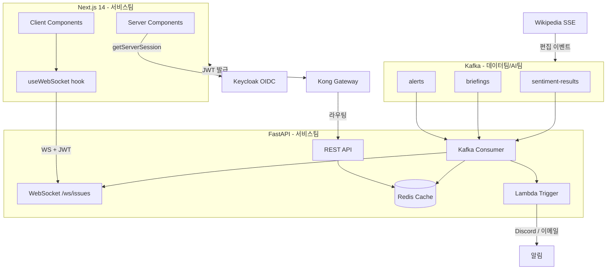
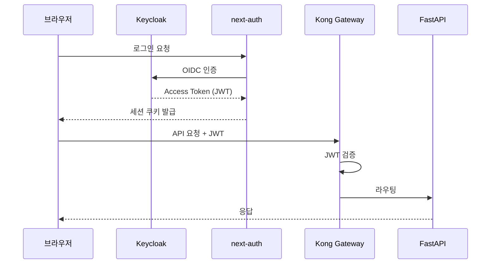
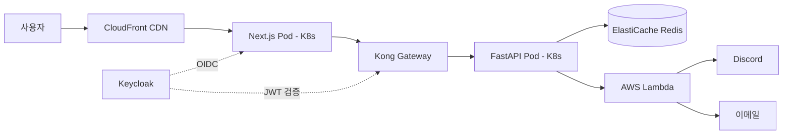
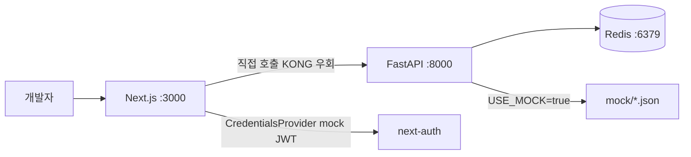

# WikiPulse — 시스템 구성도

## 전체 데이터 흐름

```mermaid
flowchart TD
    WP[Wikipedia SSE] -->|편집 이벤트| KAFKA

    subgraph KAFKA[Kafka - 데이터팀/AI팀]
        K1[sentiment-results]
        K2[briefings]
        K3[alerts]
    end

    subgraph BACKEND[FastAPI - 서비스팀]
        CONSUMER[Kafka Consumer]
        API[REST API]
        WS[WebSocket /ws/issues]
        REDIS[(Redis Cache)]
        LAMBDA[Lambda Trigger]
    end

    subgraph FRONTEND[Next.js 14 - 서비스팀]
        SSR[Server Components]
        CLIENT[Client Components]
        HOOK[useWebSocket hook]
    end

    K1 --> CONSUMER
    K2 --> CONSUMER
    K3 --> CONSUMER

    CONSUMER --> REDIS
    CONSUMER --> WS
    CONSUMER --> LAMBDA

    LAMBDA -->|Discord / 이메일| NOTIFY[알림]

    KEYCLOAK[Keycloak OIDC] -->|JWT 발급| FRONTEND
    FRONTEND -->|JWT| KONG[Kong Gateway]
    KONG -->|라우팅| API
    API --> REDIS

    SSR -->|getServerSession| KEYCLOAK
    CLIENT --> HOOK
    HOOK -->|WS + JWT| WS
```

---

## 인증 흐름

```mermaid
sequenceDiagram
    participant U as 브라우저
    participant KC as Keycloak
    participant NA as next-auth
    participant KG as Kong Gateway
    participant FA as FastAPI

    U->>NA: 로그인 요청
    NA->>KC: OIDC 인증
    KC-->>NA: Access Token (JWT)
    NA-->>U: 세션 쿠키 발급

    U->>KG: API 요청 + JWT
    KG->>KG: JWT 검증
    KG->>FA: 라우팅
    FA-->>U: 응답
```

---

## 배포 구성 (운영)

```mermaid
flowchart LR
    USER[사용자] --> CF[CloudFront CDN]
    CF --> NEXT[Next.js Pod - K8s]
    NEXT --> KONG[Kong Gateway]
    KONG --> API[FastAPI Pod - K8s]
    API --> ELASTICACHE[(ElastiCache Redis)]
    API --> LAMBDA[AWS Lambda]
    LAMBDA --> DISCORD[Discord]
    LAMBDA --> EMAIL[이메일]

    KEYCLOAK[Keycloak] -.->|OIDC| NEXT
    KEYCLOAK -.->|JWT 검증| KONG
```

---

## 로컬 개발 구성

```mermaid
flowchart LR
    DEV[개발자] --> NEXT[Next.js :3000]
    NEXT -->|직접 호출 KONG 우회| API[FastAPI :8000]
    API --> REDIS[(Redis :6379)]
    API -->|USE_MOCK=true| MOCK[mock/*.json]

    NEXT -->|CredentialsProvider mock JWT| AUTH[next-auth]
```
